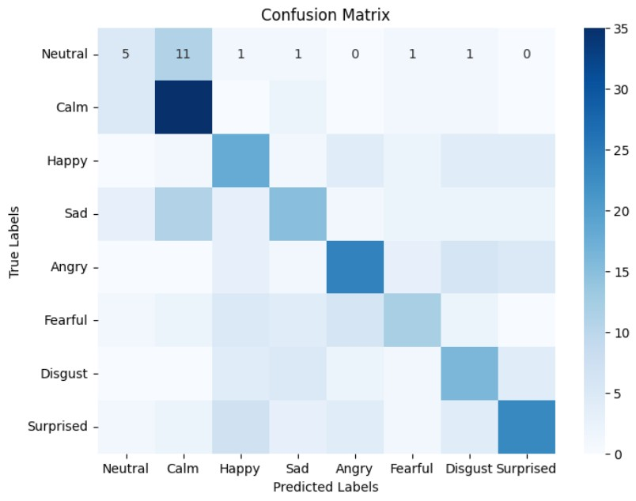
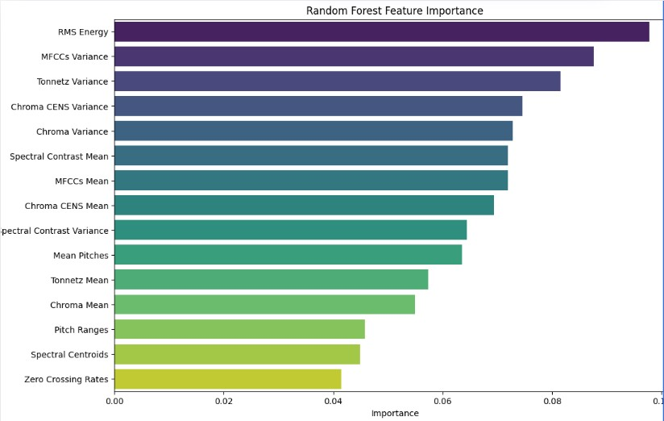

# Speech Sentiment Recognition

A compact research/prototype project that extracts audio features from speech and trains models to predict emotional sentiment.

Executive summary

- Research question: How accurately can we recognize human emotions from speech, and how well would such models work in real-world applications (virtual assistants, customer service, mental-health support)?

- Dataset: RAVDESS — 1,440 audio files from 24 actors (12 female, 12 male), 2 phrases, 8 emotions (neutral, calm, happy, sad, angry, fearful, disgust, surprised) with two intensity levels (normal, strong).

- Features & preprocessing: RMS energy, MFCCs, Tonnetz, Chroma & spectral features, and pitch extracted with librosa; standardized via sklearn's StandardScaler.

- Models: Gaussian Naïve Bayes, Random Forest (GridSearchCV for tuning), and a Convolutional Neural Network.

This repo contains scripts and notebooks for dataset download, feature extraction (librosa), model training (classical ML and CNN), and evaluation. The most complete workflows are in `notebooks/`.

Tech stack

- Python 3.10+
- numpy, pandas
- librosa (audio feature extraction)
- scikit-learn (random forest, metrics)
- tensorflow / keras (CNN experiments)
- matplotlib, seaborn (plots)
- kaggle (optional, dataset downloader)

Key graphics

Confusion matrix (model evaluation):

Key takeaways: 'calm', 'angry', and 'surprised' were most predictable; 'fearful', 'neutral', and 'sad' were least predictable. Common error: predicting 'calm' when true label was 'sad' or 'neutral'.

Feature importance (random forest):

Top features: 1) RMS energy, 2) MFCCs variance, 3) Tonnetz variance.

RMS energy distribution:

Key takeaway: 'happy', 'angry', and 'fearful' show the largest RMS distributions; 'neutral' and 'calm' the lowest.

MFCCs variance distribution:

Key takeaway: 'neutral' and 'calm' have lower MFCC variance ranges; 'fearful' shows the highest variance.

Tonnetz variance distribution:

Key takeaway: 'surprised' has the narrowest Tonnetz range; 'calm' the widest; most emotions cluster at low Tonnetz variance.

Quick pointers

- See `notebooks/ESRmodels.ipynb` for the extraction → training → evaluation pipeline.
- Use `scripts/dataset_downloader.py` to fetch datasets (requires Kaggle CLI and `kaggle.json`).
- Install dependencies with `pip install -r requirements.txt`.
- Random Forest (selected hyperparameters): max_depth=20, min_samples_leaf=2, min_samples_split=2, n_estimators=100. Test accuracy ≈ 50.69%.

- Limitations & bias: possible gender-expression differences despite balanced actors, intensity-level generalizability, and limited diversity (culture, age, accent — North American phrasing).

- Market note: Speech emotion analysis can augment sentiment/market research workflows (e.g., audio review summarization).
